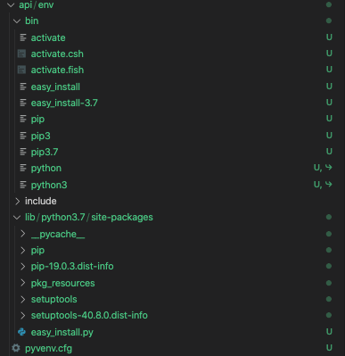

# Python Virtual Environments

Over the few months I've been learning Python applications and reading tutorials, seems like a lot of them sets up a virtual environment before any development. Although the concept of a virtual environment is relatively easy to understand, the exact steps of leveraging them in projects still confusing to me. Therefore, I am writing this post to just record different concepts and usages of virtual environment once and for all. 

## Why do we need to use virtual environments?

Virtual environment solves one problem in Python: **package dependencies.** The problem is that by default, every Python project will use the same directories to store and retrieve its specific dependencies (packages). This creates a problem with site packages, which are installed using installer or `pip`, because different versions are all stored within the same directory. 
If 2 projects require different versions of the same dependency, Python can't differentiate between versions in the same directory. This is the problem virtual environment tries to solve.  


Virtual environment allows us to create an isolated environment for each project we have, and therefore each project can have its own specific versions of dependencies. This is kind of analogous to `package.json` of a node app. 

Virtual environments can be created using `virtualenv` or `penv` command line tools. For a more specific comparison of the 2, checkout: [TODO]. 

## Usage

I use `Python 3.7` therefore `venv` is a built-in module from Python that allows me to create virtual environments. 

If using older version of Python, you have to install `virtualenv` as a site package using 
```Python
pip install virtualenv
```
> Since I already have it installed, the terminal displays:
> ```Requirement already satisfied: virtualenv in ./opt/miniconda3/lib/python3.7/site-packages (16.7.9)```
> Since I used pip install, it's trying to install the package to the site-packages directory under the Anaconda distribution Python directory. 

In this post, I will be creating a Django API for one of my projects using `venv`. 

First, I created the project directory and created the virtual environment:
```shell
mkdir api && cd api
python -m venv env
```
> I'm using Python 3, so I'm using the built-in `venv` module

The above command creates a directory called `env` inside the `api` directory, and its structure looks like this:



Since I don't really care about how virtual environment works, the main things that I need to know about this directory is:
- `bin` includes files that interacts with the environment
- `include`: C headers that compile Python packages
- `lib`: includes python version and all the site-packages (analogous to `node_module` folder for JS applications)

To use the environment's packages, I need to **active the environment** using a script inside `bin` directory:
```
source env/bin/activate
(env) $
```
The `(env)` prefix means the virtual environment I just created is now activated, and I can't use any of the site-packages previously installed to `/opt/miniconda3/lib/python3.7/site-packages` since my environment is isolated. If I perform `pip install` under the environment, all packages will be installed specific to the virtual environment. 

For example:
```Shell
(env) $ python -c "import django"
Traceback (most recent call last):
  File "<string>", line 1, in <module>
ModuleNotFoundError: No module named 'django'

$ python -c "import django"
No errors
```
> This is because I had Django installed in my Python distribution directory, but not in my virtual environment's lib directory.

There are some nitty-gritty details about how virtual environment works and it gets into $PATH variables and Python binary locations which are out of the scope of this post. If interested, they can be found here: [https://realpython.com/python-virtual-environments-a-primer/#how-does-a-virtual-environment-work](https://realpython.com/python-virtual-environments-a-primer/#how-does-a-virtual-environment-work)


## Installing Django

To install Django, I ran the following command which was found in their official documentation:

```
(env) $ pip install Django==3.0.5
(env) $ python -m django --version
3.0.5
```

So now Django is officially installed under the virtual environment! Whenever I need to develop on my project, I just have to run `source env/bin/activate` and all the dependencies I installed under the virtual environment will be available to me. 


## References
- [https://realpython.com/python-virtual-environments-a-primer/](https://realpython.com/python-virtual-environments-a-primer/)